# Kubernetes Memos-Application on AWS EKS
## Tech Stack


## Architecture
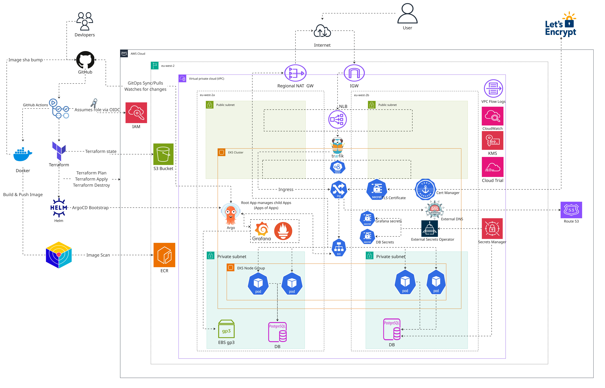

## Table of Contents

- [Tech Stack](#tech-stack)
- [Architecture](#architecture)
- [Overview](#overview)
- [Quick Start](#quick-start)
- [Platform Demo](#platform-demo)
- [Design Priorities](#design-priorities)
- [Architecture Overview](#architecture-overview)
  - [Bootstrap Infrastructure](#bootstrap-infrastructure)
  - [Modular Terraform](#modular-terraform)
  - [Container Build (Docker)](#container-build-docker)
  - [Kubernetes Platform](#kubernetes-platform)
  - [Helm & GitOps with Argo CD](#helm--gitops-with-argo-cd)
  - [App of Apps (Argo CD)](#app-of-appsargo-cd)
  - [Secrets Management](#secrets-management)
  - [Security](#security)
  - [CI/CD Pipeline](#cicd-pipeline)
- [Known Limitations and Future Improvements](#known-limitations-and-future-improvements)
  - [Known Limitations](#known-limitations)
  - [Future Improvements](#future-improvements)
- [Screenshots](#screenshots)
  - [Application Running](#application-running)
  - [Lets-encrypt Certificate](#lets-encrypt-certifcate)
  - [ArgoCD](#argocd)
    - [Apps of Apps Root](#apps-of-apps-root)
    - [ArgoCD Applications](#argocd-applications)
    - [Memos ArgoCD Application](#memos-argocd-application)
  - [Grafana Dashboard](#grafana-dashboard)
    - [Cluster Dashboard](#cluster-dashboard)
  - [Prometheus](#prometheus)
    - [Prometheus Middleware Auth Page](#prometheus-middle-ware-auth-page)
  - [Pipelines](#pipelines)
    - [Docker Build and Push](#docker-build-and-push)
    - [Terraform Plan](#terraform-plan)
    - [Terraform Apply](#terraform-apply)
    - [Terraform Destroy](#terraform-destroy)
- [Repository Layout](#repository-layout)


## Overview
AWS EKS platform running Memos, a self-hosted note-taking app, backed by RDS PostgreSQL. Terraform provisions the infrastructure, Argo CD reconciles everything inside the cluster from this repo.

Built stage by stage, covering the full lifecycle from infrastructure through to application deployment and day-two operations.

## Quick Start
Want to test the application locally?

**Prerequisites:** Docker installed and running.

This builds the custom multi-stage image used by this project (Node/pnpm frontend, Go backend, `scratch` final stage)

```bash
cd app/memos
docker build -t memos:v1 .
docker run -d \
  --name memos \
  -p 5230:5230 \
  -v ~/.memos/:/var/opt/memos \
  memos:v1
```
Then open ```http://localhost:5230```

Check it's up:

```bash
docker logs memos
```

Stop and remove the container:

```bash
docker stop memos && docker rm memos
```

## Design Priorities

* **Modular Terraform**, One module per concern: networking, EKS, RDS, security. Any layer can be changed or replaced in isolation.

* **GitOps via Argo CD**, Git as the single source of truth, every cluster change is version-controlled, auditable, and reproducible from the repo alone, not from memory of what was manually applied.

* **Zero standing credentials.**, EKS Pod Identity for every in-cluster workload, GitHub OIDC for every CI workflow, no long-lived AWS access keys anywhere in the project.

* **Fully automated TLS and DNS**,cert-manager and ExternalDNS own certificate issuance and DNS records end to end. Nobody touches Route 53 or a cert file by hand.

* **Recoverability over convenience** Argo CD is deployed by Terraform, not self-managed. A bad GitOps change can't take down the tool needed to fix it.

* **Least privilege where it matters, deliberate debt where it doesn't.** IAM policies for KMS keys and Secrets Manager entries are scoped to exact ARNs. Wildcard actions on lower-risk roles are accepted short-term, and tracked as debt rather than ignored.

* **Verify against reality, not assumption.**. Terraform validation checks real AWS constraints, ARN formats, enum values, not generic non-empty checks. Several were confirmed against live documentation mid-build.

* **Security scanning built into CI, not bolted on after.** Trivy scans Terraform and the image before anything reaches the cluster. Hadolint and TFLint catch structural issues before a plan even runs.


## Architecture Overview

The platform is composed of several layers that work together to automate infrastructure provisioning and application delivery end to end.

### Bootstrap Infrastructure

Infrastructure is split into two Terraform layers: bootstrap and main.

Bootstrap creates what has to exist before the main config can run:

- S3 remote state storage, native state locking
- Amazon ECR
- GitHub OIDC provider and roles

This avoids the obvious circular dependency: the main config's S3 backend can't exist until something creates the bucket first. Running it as code instead of clicking through the console once means the whole platform is reproducible from a blank AWS account.

**Why this matters?**

Bootstrap resources also rarely change and rarely need tearing down. Keeping them in separate state means a full terraform destroy of the main stack doesn't take the state bucket or OIDC trust with it.

### Modular Terraform

Organised into modules by concern rather than one flat configuration:

- Networking (VPC, subnets, NAT, VPC endpoints)
- EKS: Cluster, node group, add-ons, access entries
- RDS
- Security: Security groups
- Pod Identity

**Why this matters?**

A change to one layer, such as resizing the node group or adjusting an RDS parameter, doesn't require reasoning about the whole stack, and each module can be planned or reasoned about independently.

### Container Build (Docker)

Multi-stage Docker build, frontend and backend compiled separately from the final runtime image:

The build process:

- Compiles the Vite/TypeScript frontend with Node and pnpm.
- Compiles the Go backend, with the frontend embedded into the binary via go:embed.
- Final stage is using scratch, containing only the compiled binary and its TLS certificate bundle.
- Runs as a non-root user (UID 10001).

**Why this matters?**

- Smaller deployment artifact, no OS, no package manager, no shell.

- Reduced attack surface, there is nothing in the image an attacker could use beyond the application itself.

- go:embed removes the need to ship or mount frontend assets separately from the binary that serves them.

### Kubernetes Platform

EKS is the orchestration layer. Everything else is a Kubernetes component running on top of it, each with one job:

- Traefik: ingress
- Cert-manager: certificates
- ExternalDNS: DNS records
- External Secrets Operator: secret sync
- Kube-prometheus-stack: Prometheus, Grafana
- Argo CD: reconciliation

Nothing here is installed by hand. Argo CD deploys and reconciles all of it from Git, so the cluster's state is reproducible, not remembered.

**Why this matters?**

Each component has one clear responsibility. Ingress, TLS, DNS, and secrets are handled by separate, independently replaceable tools rather than one monolithic layer, which keeps the failure surface of any single incident contained to the component that owns it.

### Helm & GitOps with Argo CD

Third-party components are Helm charts with a values overlay from this repo. Memos is its own custom chart, managing Deployment, Service, Ingress, and the ExternalSecret for its database DSN.

Every Argo CD Application runs the same three settings: automated sync, self-heal, and prune. Drift gets reverted, resources removed from Git get deleted, nothing needs a manual sync.


**Why this matters?**

Git becomes the single source of truth. A kubectl edit against a live resource doesn't stick; Argo CD reverts it on the next reconciliation pass. Every change to the cluster's state has a corresponding commit.

### App of Apps(Argo CD)
- One root Application, applied once by hand with kubectl apply. It's the only object ever applied directly to the cluster.

- The root Application points at argo-cd/apps/ in this repo, Argo CD discovers every file there and manages each one as its own child Application, syncing continuously with no further manual intervention

- Child Applications fall into three shapes: third-party Helm charts with a values overlay from values/, plain manifests with no upstream chart from infrastructure/, and the Memos chart in my-chart/

- prune: true and selfHeal: true are set on every Application, so removing a file from Git deletes the resource, and manual drift on a live resource gets reverted automatically

> **Note**
Sync waves order the dependencies that actually need it. ClusterIssuer waits for cert-manager's CRDs; ClusterSecretStore waits for External Secrets' CRDs. Skip this and an Application can fail its first sync just because the CRD it needs hasn't landed yet.

**Why this matters?**

Every component, Traefik through Memos, gets added by committing a file, not running a command. Rebuilding the cluster needs exactly one manual step; Argo CD does the rest by reading the same repo you would.

### Secrets Management

Nothing sensitive is committed to Git or stored in plaintext in Terraform state.

- RDS credentials: generated and stored by AWS (manage_master_user_password), encrypted with KMS.

- External Secrets Operator reads them from Secrets Manager, writes them as Kubernetes Secrets.

- Deployments consume secrets through environment variables sourced from those Secrets.

- External Secrets' IAM role is scoped to the specific secret ARN and KMS key, not the account's secrets broadly

**Why this matters?**

The database password never touches a .tf file, a terraform plan diff, or a manifest. AWS generates it, a scoped role reads it, sync keeps it current.


### Security

Security was built in throughout rather than added afterwards:

- GitHub OIDC for CI, no long-lived AWS credentials anywhere

- Pod Identity scoped per workload, per (namespace, service_account) pair

- KMS encryption on every Secrets Manager entry

- Hadolint on the Dockerfile

- Trivy on the built image, CRITICAL findings block the pipeline

- Trivy on Terraform

- RDS is private, not publicly accessible

- Cert-manager issues and renews HTTPS certificates automatically

- Application container runs non-root, UID 10001, runAsNonRoot enforced

- Gitleaks before a commit reaches the remote

- Pre-commit hooks run the same checks locally, before any of that

**Why this matters?**

A leaked secret gets caught locally. A vulnerable image gets caught in CI. A compromised build pipeline still can't reach infrastructure: it authenticates through its own narrowly scoped OIDC role, separate from the one Terraform uses.

### CI/CD Pipeline

GitHub Actions automates delivery:

- Terraform: format check, TFLint, validate, and a Trivy IaC scan, with the plan posted as a PR comment

- Apply on merge to main destroy is manual-dispatch only, gated behind a typed confirmation

- Docker: Hadolint, build with layer caching, Trivy image scan, push to ECR tagged by commit SHA

- The build workflow commits the new image tag and digest back into the Memos chart's values.yaml, which Argo CD then picks up and syncs automatically

- AWS auth throughout is GitHub OIDC, separate roles for Terraform and image builds.

**Why this matters?**

There is no manual deployment step anywhere in this pipeline. A merge to mai` is the only action a human takes, everything from validation through to the running pod is automated and auditable from the commit history.

## Known Limitations and Future Improvements

### Known Limitations

- **Spot instances carry interruption risk for stateful workloads.** A Spot interruption took a node NotReady while it happened to be hosting external-secrets-webhook, which briefly broke every ExternalSecret operation cluster-wide until it rescheduled.

- **Single NAT Gateway is a cost decision, not a resilience one.** All three AZs route their egress through it, so an outage in its AZ takes down egress for the whole cluster. VPC endpoints for S3, STS, and ECR reduce reliance on it but don't remove the risk.

- **RDS runs single-AZ, not Multi-AZ.** No automatic failover if that AZ has a problem.

- **The RDS endpoint is hardcoded in the ExternalSecret's DSN template rather than pulled from Secrets Manager.** The RDS-managed secret only stores username and password, not connection details.

- **Wildcard IAM actions are still on the Terraform OIDC role** (iam:*, ec2:*). Accepted as deliberate short-term debt, narrowing hasn't happened yet.

- **No multi-environment separation yet.** The pipeline is scaffolded for staging/prod but only runs against dev right now.

- **No SSM access on worker nodes**, so a node-level failure like the unexplained Spot NotReady incident can't be investigated at the kubelet level.

- **Node scaling is manual.** Capacity issues during this project were resolved by adding nodes by hand rather than the cluster reacting on its own via Karpenter.

### Future Improvements

- Right-size resource requests and limits using real Prometheus data instead of the estimates currently in place.

- Add LimitRange and ResourceQuota per namespace, neither of which exist yet.

- Build out NetworkPolicies, default-deny per namespace with explicit allows for the ingress path, Memos to RDS, and DNS. Right now the pod network is wide open.

- Move Pod Security Standards from nothing to baseline, then tighten toward restricted, starting with Memos since it already runs non-root.

- Add PodDisruptionBudgets for Traefik and cert-manager, and spread Traefik across AZs with topologySpreadConstraints. There's currently no guarantee against losing every ingress replica to a single AZ.

- Rebalance the node group across AZs. It's currently skewed, which makes any AZ-pinned PVC a single point of failure.

- Narrow the wildcard IAM actions on the Terraform role down to what each workflow actually needs.

- Replace the manually-scaled managed node group with Karpenter, so the cluster provisions and right-sizes nodes automatically based on actual pending pod requirements.

# Screenshots

## Application running
### Demo

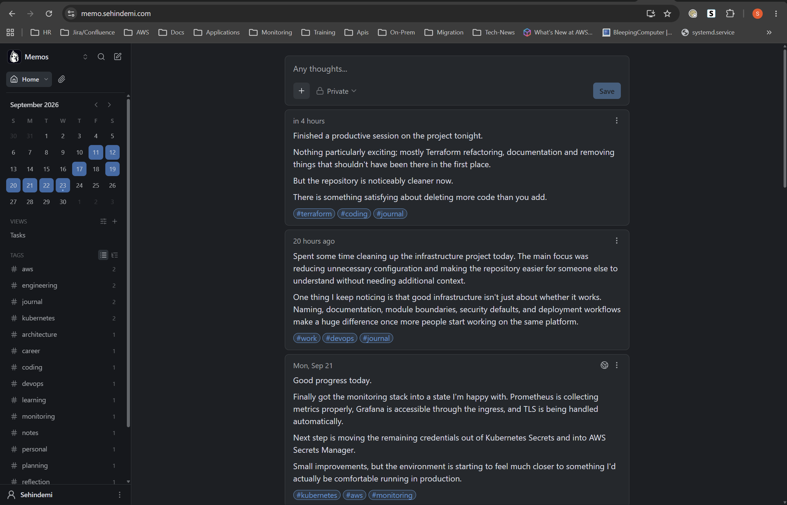

## Lets-encrypt certifcate
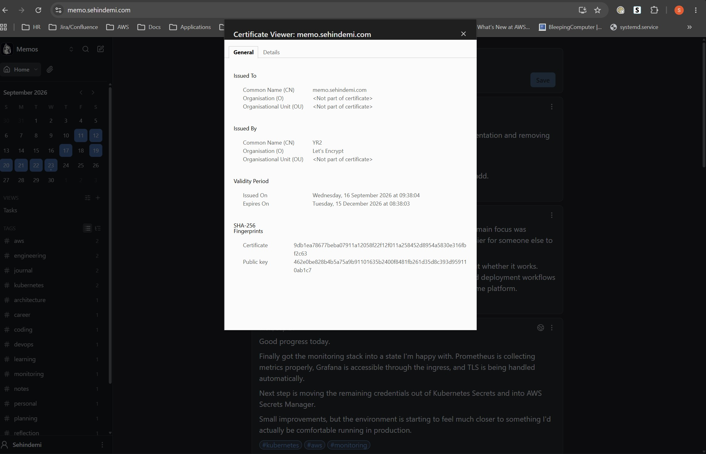

## ArgoCD

### Apps of Apps root
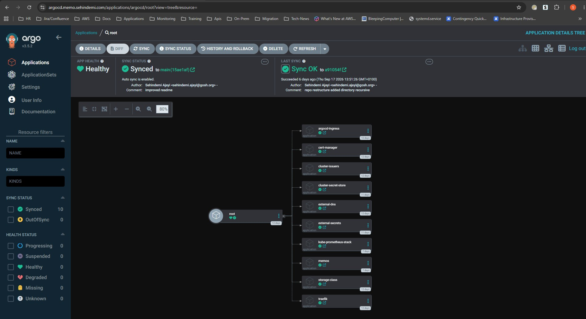

### Argocd Applications
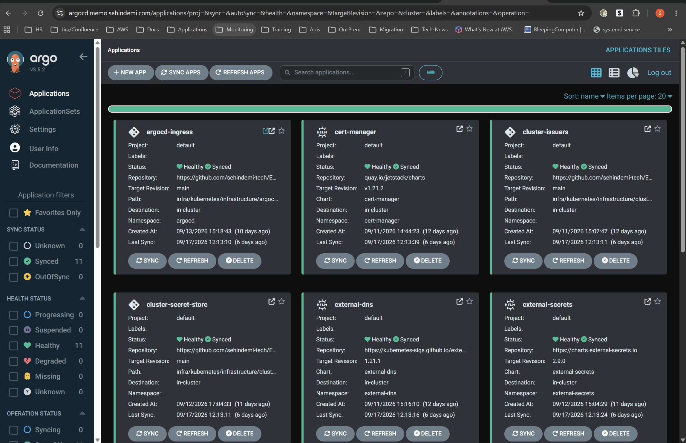

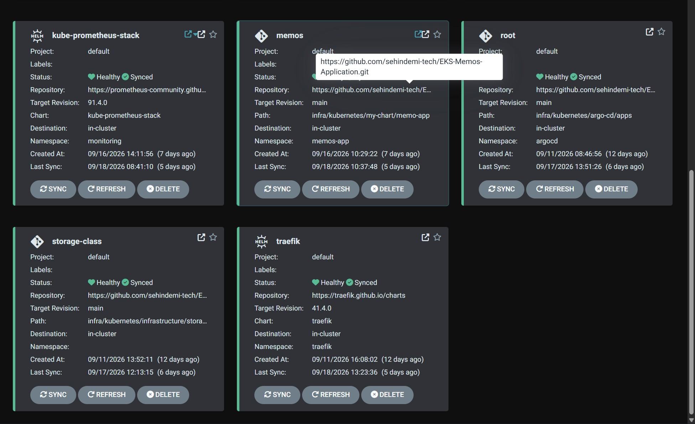

### Memos ArgoCD Application
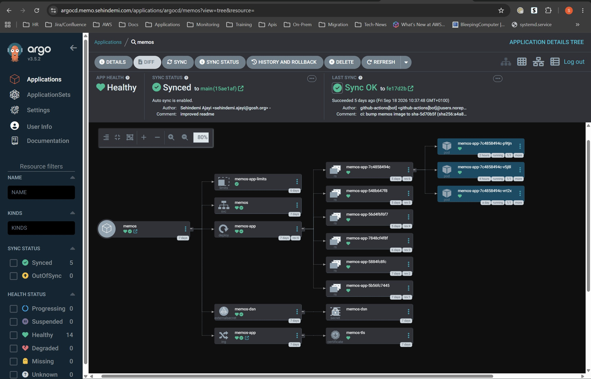

## Grafana Dashboard
### Cluster Dashboard
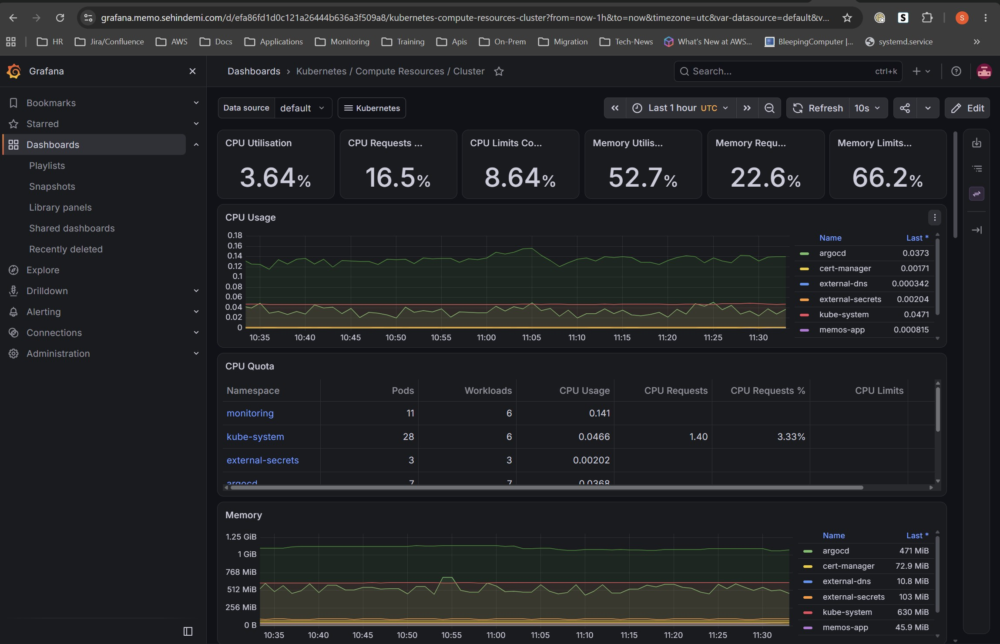

## Prometheus
### Prometheus Middle ware auth page
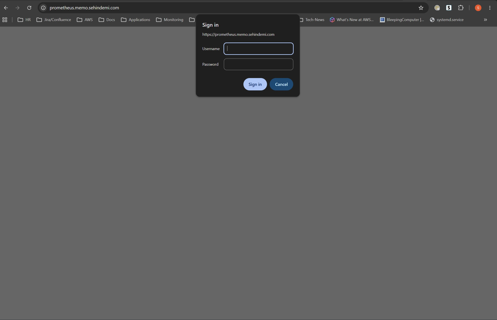

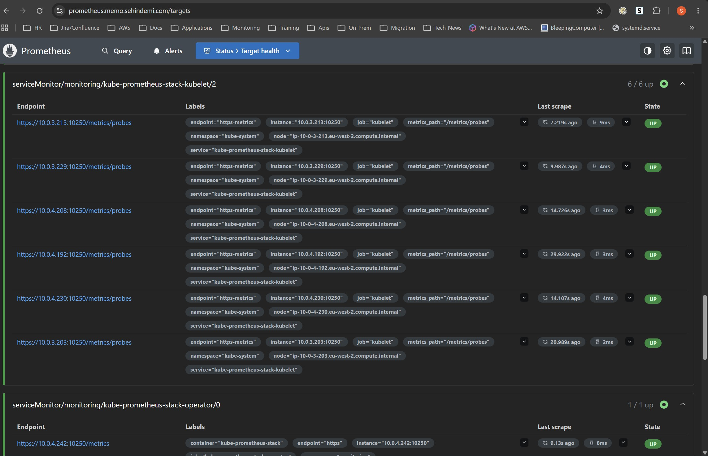

## ArgoCD, Grafana & Prometheus Demo


## Pipelines
### Docker Build and Push
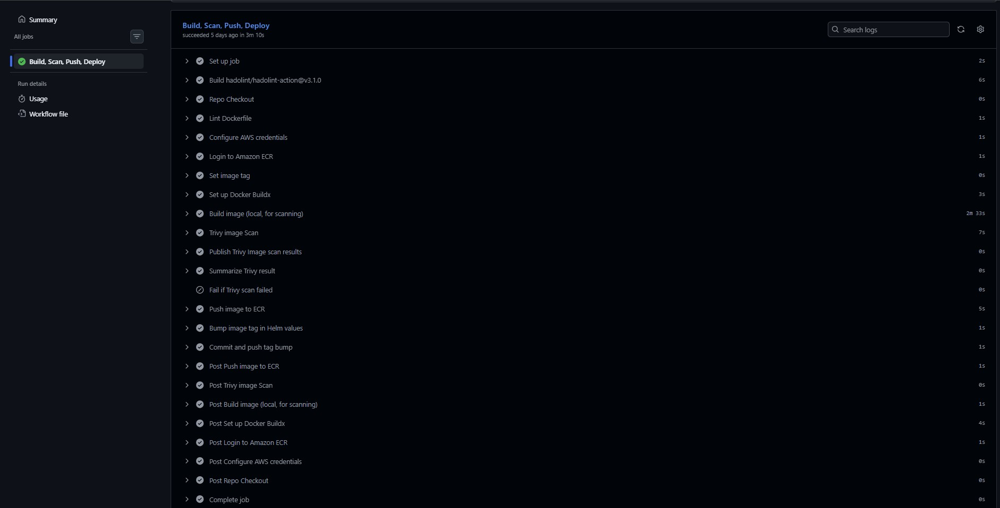

### Terraform Plan
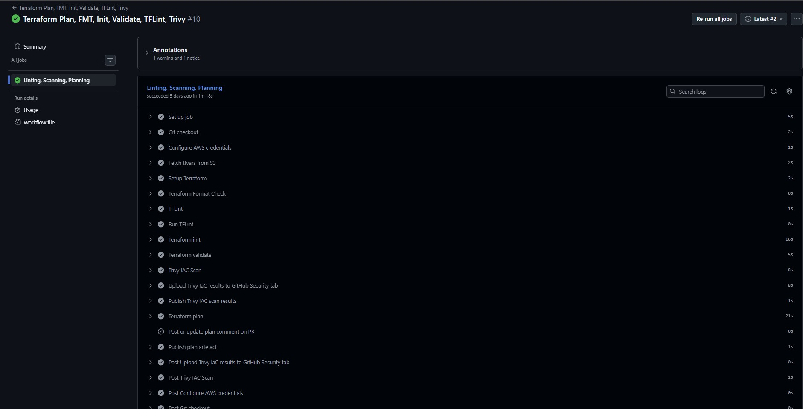

### Terraform Apply
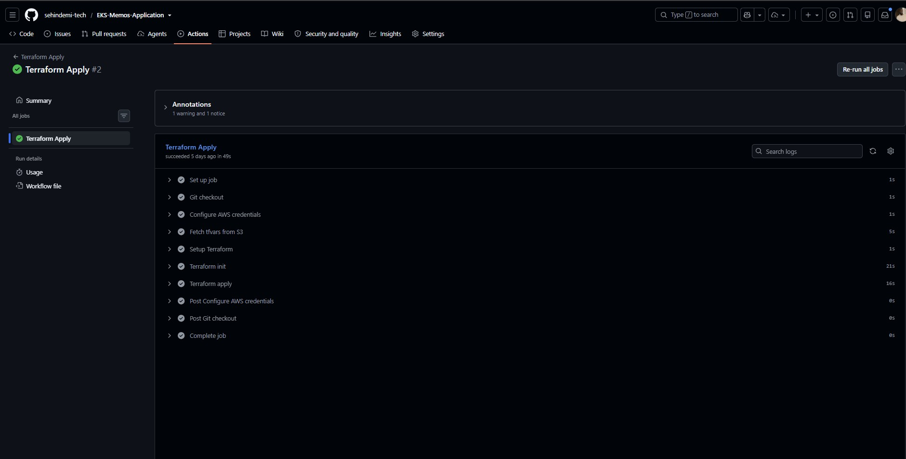
### Terraform Destroy

